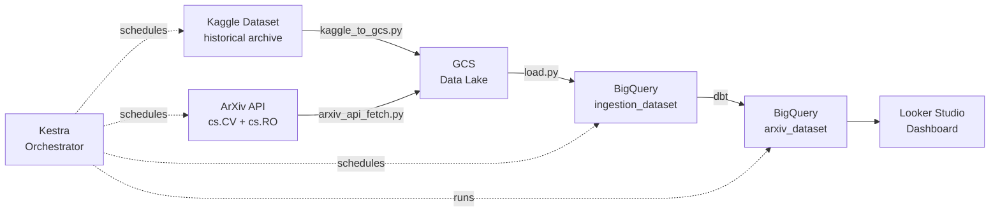
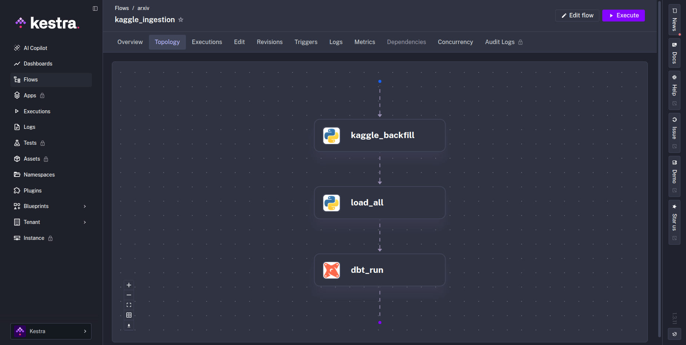
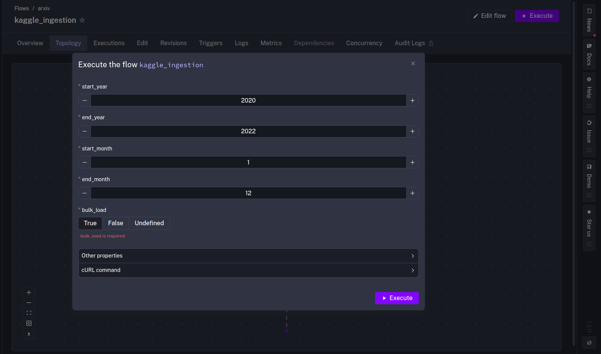
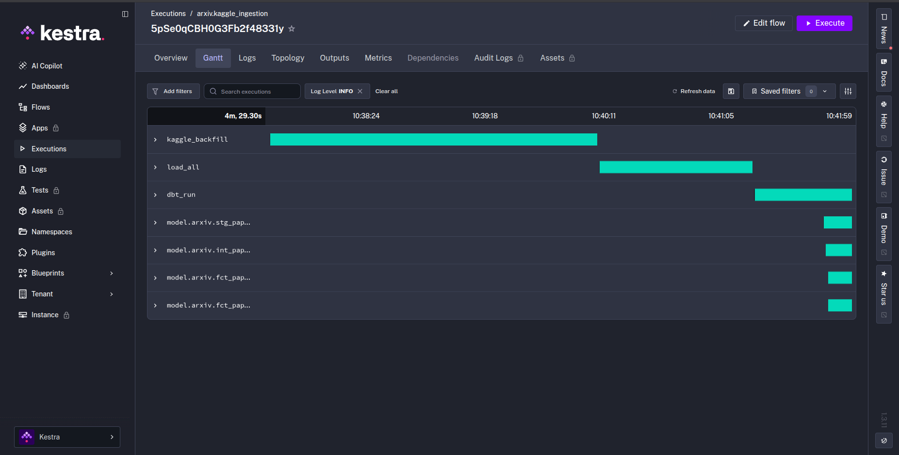
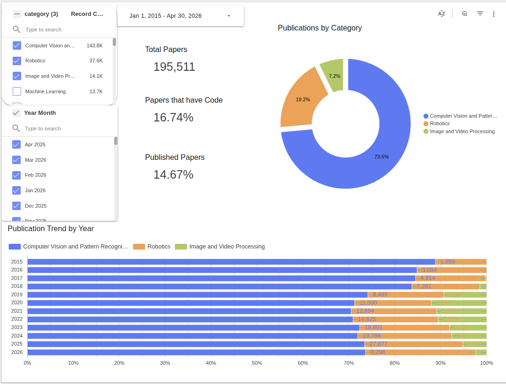

# arXiv Data Pipeline


> *Source*: Page header here [Link](https://arxiv.org/)

An end-to-end batch data engineering pipeline that ingests, transforms, and visualizes ArXiv research paper metadata for Computer Vision (cs.CV) and Robotics (cs.RO).

Built as the final project for [DE Zoomcamp 2026](https://github.com/DataTalksClub/data-engineering-zoomcamp).

**Dashboard:** https://datastudio.google.com/reporting/2644e509-03e4-4404-bcc2-7891f89fcba1


## Problem Statement

ArXiv publishes thousands of research papers per month across Computer Vision and Robotics. There is no easy way to see publication trends over time, which topics are growing, or how open-source adoption has changed. This pipeline collects paper metadata from two sources (Kaggle historical dataset + ArXiv API for recent papers), loads it into BigQuery, and exposes it through an interactive dashboard.

For full setup instructions see [SETUP.md](./SETUP.md).


## Architecture



All steps are orchestrated by Kestra. For local development, Kestra runs via Docker Compose on your machine. For production, it runs on a GCP VM provisioned by Terraform. The pipeline logic is identical in both cases.

### Kestra Flows

**Flow topology**: task graph for `kaggle_ingestion` (the relevant Kestra flow here):



**Flow parameters** (configurable inputs per run):

- Start and end Month and Year specify what timeframe from the data gets uploaded. 
- `bulk_load` specifies if all data is loaded to Bigquery at once (True) or incremental (False)
  - This is relevant if your computer is not strong enough to load multiple years of data into RAM



**Successful execution:**




## Tech Stack

| Component              | Tool                               |
| ---------------------- | ---------------------------------- |
| Cloud                  | GCP                                |
| Infrastructure as Code | Terraform                          |
| Orchestration          | Kestra                             |
| Data Lake              | GCS                                |
| Data Warehouse         | BigQuery (partitioned + clustered) |
| Transformations        | dbt                                |
| Dashboard              | Looker Studio                      |
| CI/CD                  | GitHub Actions (lint on PR; Docker build + Cloud Run deploy on merge) |


## Data Sources

### Kaggle arXiv Dataset

[Cornell-University/arxiv](https://www.kaggle.com/datasets/Cornell-University/arxiv) — a regularly updated JSONL snapshot of all arXiv paper metadata maintained by Cornell University. This is the primary data source for historical papers (2007 to present). The pipeline filters to cs.CV and cs.RO categories.

| Field | Type | Description |
|---|---|---|
| `id` | string | ArXiv paper ID (e.g. `2301.00001`) |
| `submitter` | string | Name of the submitter |
| `authors` | string | Raw author string |
| `authors_parsed` | list | Parsed as `[[last, first, suffix], ...]` |
| `title` | string | Paper title |
| `abstract` | string | Paper abstract |
| `categories` | string | Space-separated category codes (e.g. `cs.CV cs.LG`) |
| `comments` | string | Author comments (pages, figures, links) |
| `journal-ref` | string | Journal or conference reference |
| `doi` | string | DOI if journal-published |
| `report-no` | string | Report number (not used by pipeline) |
| `license` | string | License (not always present) |
| `versions` | list | `[{version, created}, ...]` — full version history |
| `update_date` | string | Date of latest version |

### ArXiv API

Supplemental live fetch for the most recent papers (cs.CV + cs.RO), paginated at 2000 results per request. Used to top up the dataset with papers not yet in the Kaggle snapshot.


## BigQuery Tables

| Table                                 | Description                                                             |
| ------------------------------------- | ----------------------------------------------------------------------- |
### `ingestion_dataset.papers` (raw, partitioned by month + clustered by primary_category)

| Column | Type | Description |
|---|---|---|
| `arxiv_id` | STRING | Unique ArXiv identifier (no version suffix) |
| `title` | STRING | Paper title |
| `abstract` | STRING | Paper abstract |
| `authors` | STRING REPEATED | List of author names |
| `primary_category` | STRING | Primary ArXiv category (e.g. cs.CV) |
| `all_categories` | STRING REPEATED | All categories including cross-listings |
| `version` | INTEGER | Latest version number |
| `doi` | STRING | DOI if journal-published |
| `journal_ref` | STRING | Journal or conference reference string |
| `comment` | STRING | Author comment (pages, figures, GitHub links) |
| `date_published` | DATE | Original submission date (v1), partition key |
| `date_updated` | DATE | Date of latest version |
| `submission_year` | INTEGER | Year extracted from date_published |
| `submission_month` | INTEGER | Month extracted from date_published |
| `has_code` | BOOL | True if a GitHub link is present in comment or abstract |
| `is_survey` | BOOL | True if title contains the word "survey" |

### `arxiv_dataset.fct_papers` (mart, partitioned + clustered)

| Column | Type | Description |
|---|---|---|
| `arxiv_id` | STRING | Unique ArXiv identifier (no version suffix) |
| `title` | STRING | Paper title |
| `authors` | ARRAY\<STRING\> | List of author names |
| `primary_category` | STRING | Primary ArXiv category (e.g. cs.CV) |
| `all_categories` | ARRAY\<STRING\> | All categories including cross-listings |
| `category` | STRING | Human-readable category name |
| `subject_group` | STRING | Top-level subject group (e.g. cs, eess) |
| `version` | STRING | Latest version number |
| `doi` | STRING | DOI if journal-published |
| `journal_ref` | STRING | Journal or conference reference string |
| `is_published` | BOOL | True if doi or journal_ref is present |
| `comment` | STRING | Author comment |
| `date_published` | TIMESTAMP | Original submission date (v1), partition key (by month) |
| `date_updated` | DATE | Date of latest version |
| `year` | INT64 | Submission year |
| `month` | INT64 | Submission month |
| `has_code` | BOOL | True if a GitHub link is present |
| `is_survey` | BOOL | True if the paper is identified as a survey |

### `arxiv_dataset.fct_papers_embeddings` (mart)

| Column | Type | Description |
|---|---|---|
| `arxiv_id` | STRING | Unique ArXiv identifier |
| `title` | STRING | Paper title |
| `abstract` | STRING | Paper abstract, primary input for embedding generation |
| `primary_category` | STRING | Primary ArXiv category |
| `category` | STRING | Human-readable category name |
| `date_published` | DATE | Original submission date |
| `year` | INT64 | Submission year |
| `month` | INT64 | Submission month |

### `arxiv_dataset.arxiv_categories` (dbt seed)

| Column | Type | Description |
|---|---|---|
| `category_id` | STRING | ArXiv category identifier (e.g. cs.CV, cs.RO) |
| `group` | STRING | Top-level subject group (e.g. cs, eess, math) |
| `name` | STRING | Human-readable category name |
| `description` | STRING | Full description of the category scope |


## Dashboard

Live at: https://datastudio.google.com/reporting/2644e509-03e4-4404-bcc2-7891f89fcba1

Tiles:

- **`Category Distribution`** (pie chart): paper count per category, filterable by date range
- **`Publication Trend by Year`** (stacked bar chart): papers per category per year, 2015-2026
- **`Scorecards`**: Total Papers, Code Adoption Rate, Published Rate



## Quickstart

See [SETUP.md](./SETUP.md) for full instructions. Short version:

```bash
# 1. First apply (deploy_kestra=false) - creates GCP resources + service account key
cp terraform_local/terraform.tfvars.example terraform_local/terraform.tfvars
# fill in project_id, data_bucket (unique name), data_dir
terraform -chdir=terraform_local init -backend-config="bucket=arxiv-tf-state-YOUR_PROJECT_ID"
terraform -chdir=terraform_local apply -var-file="terraform.tfvars" -auto-approve

# 2. Configure Kestra credentials (credentials/pipeline-sa.json now exists)
cp kestra/.env.example kestra/.env
# fill in base64-encoded Kaggle + GCP SA values (see SETUP.md)

# 3. Start Kestra
docker compose -f kestra/docker-compose.yml up -d

# 4. Second apply - seeds KV store + uploads namespace files
terraform -chdir=terraform_local apply -var-file="terraform.tfvars" -var="deploy_kestra=true" -auto-approve

# 5. Trigger pipeline in Kestra UI at http://localhost:8080
# Run kaggle_ingestion first, then arxiv_pipeline
```


## Repository Structure

```
├── pipeline/
│   ├── arxiv_api_fetch.py     fetches recent papers from ArXiv API, uploads to GCS
│   ├── kaggle_to_gcs.py       downloads Kaggle dataset, uploads to GCS
│   └── load.py                loads raw JSON from GCS into BigQuery
├── arxiv/
│   ├── models/
│   │   ├── staging/           stg_papers (view, cleaned + typed)
│   │   ├── intermediate/      int_papers_categories (view, joins taxonomy seed)
│   │   └── marts/             fct_papers, fct_papers_embeddings (tables)
│   └── seeds/
│       └── arxiv_categories.csv   ArXiv category taxonomy (id, name, group)
├── kestra/
│   ├── docker-compose.yml     local Kestra + Postgres setup
│   └── flows/
│       ├── main_arxiv_kaggle_ingestion.yml    Kaggle ingest flow
│       └── main_arxiv_arxiv_pipeline.yml      ArXiv API fetch + load + dbt flow
├── terraform/                 Full GCP deployment (VM, Cloud Run, IAM, GCS, BigQuery)
├── terraform_local/           Partially GCP deployment (GCS + BigQuery only, no VM)
└── .github/workflows/         CI: ruff lint on PR
```


## Attribution

Thank you to [arXiv](https://arxiv.org) for use of its open access interoperability.
