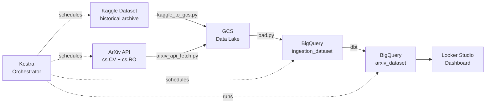

# arXiv Data Pipeline

An end-to-end batch data engineering pipeline that ingests, transforms, and visualizes ArXiv research paper metadata for Computer Vision (cs.CV) and Robotics (cs.RO).

Built as the capstone project for [DE Zoomcamp 2026](https://github.com/DataTalksClub/data-engineering-zoomcamp).

**Dashboard:** https://datastudio.google.com/reporting/2644e509-03e4-4404-bcc2-7891f89fcba1


## Problem Statement

ArXiv publishes thousands of research papers per month across Computer Vision and Robotics. There is no easy way to see publication trends over time, which topics are growing, or how open-source adoption has changed. This pipeline collects paper metadata from two sources (Kaggle historical dataset + ArXiv API for recent papers), loads it into BigQuery, and exposes it through an interactive dashboard.

For full setup instructions see [SETUP.md](./SETUP.md).


## Architecture



All steps are orchestrated by Kestra. For local development, Kestra runs via Docker Compose on your machine. For production, it runs on a GCP VM provisioned by Terraform. The pipeline logic is identical in both cases.


## Tech Stack

| Component              | Tool                               |
| ---------------------- | ---------------------------------- |
| Cloud                  | GCP                                |
| Infrastructure as Code | Terraform                          |
| Orchestration          | Kestra                             |
| Data Lake              | GCS                                |
| Data Warehouse         | BigQuery (partitioned + clustered) |
| Transformations        | dbt                                |
| Dashboard              | Looker Studio                      |
| CI/CD                  | GitHub Actions (lint on PR; Docker build + Cloud Run deploy on merge) |


## Data Sources

- **Kaggle:** [arXiv Dataset](https://www.kaggle.com/datasets/Cornell-University/arxiv) - near up-to-date and historical metadata from Cornell University. The pipeline is primarily built around this dataset as the main data source.
- **ArXiv API:** supplemental live fetch for the most recent papers (cs.CV + cs.RO), paginated at 2000 results/request


## BigQuery Tables

| Table | Description |
|---|---|
| `ingestion_dataset.papers` | Raw paper metadata, partitioned by published date |
| `arxiv_dataset.fct_papers` | Cleaned fact table, partitioned by month, clustered by primary_category |
| `arxiv_dataset.fct_papers_embeddings` | Paper text fields for downstream NLP tasks |

`fct_papers` is the primary table for the dashboard. It includes category names from the ArXiv taxonomy seed, derived flags (`has_code`, `is_published`, `is_survey`), and submission year/month columns.


## Dashboard

Live at: https://datastudio.google.com/reporting/2644e509-03e4-4404-bcc2-7891f89fcba1

Tiles:

- **`Category Distribution`** (pie chart): paper count per category, filterable by date range
- **`Publication Trend by Year`** (stacked bar chart): papers per category per year, 2015-2026
- **`Scorecards`**: Total Papers, Code Adoption Rate, Published Rate


## Quickstart

See [SETUP.md](./SETUP.md) for full instructions. Short version:

```bash
# 1. First apply (deploy_kestra=false) - creates GCP resources + service account key
cp terraform_local/terraform.tfvars.example terraform_local/terraform.tfvars
# fill in project_id, data_bucket (unique name), data_dir
terraform -chdir=terraform_local init
terraform -chdir=terraform_local apply -var-file="terraform.tfvars" -auto-approve

# 2. Configure Kestra credentials (credentials/pipeline-sa.json now exists)
cp kestra/.env.example kestra/.env
# fill in base64-encoded Kaggle + GCP SA values (see SETUP.md)

# 3. Start Kestra
docker compose -f kestra/docker-compose.yml up -d

# 4. Second apply - seeds KV store + uploads namespace files
terraform -chdir=terraform_local apply -var-file="terraform.tfvars" -var="deploy_kestra=true" -auto-approve

# 5. Trigger pipeline in Kestra UI at http://localhost:8080
# Run kaggle_ingestion first, then arxiv_pipeline
```


## Repository Structure

```
├── pipeline/
│   ├── arxiv_api_fetch.py     fetches recent papers from ArXiv API, uploads to GCS
│   ├── kaggle_to_gcs.py       downloads Kaggle dataset, uploads to GCS
│   └── load.py                loads raw JSON from GCS into BigQuery
├── arxiv/
│   ├── models/
│   │   ├── staging/           stg_papers (view, cleaned + typed)
│   │   ├── intermediate/      int_papers_categories (view, joins taxonomy seed)
│   │   └── marts/             fct_papers, fct_papers_embeddings (tables)
│   └── seeds/
│       └── arxiv_categories.csv   ArXiv category taxonomy (id, name, group)
├── kestra/
│   ├── docker-compose.yml     local Kestra + Postgres setup
│   └── flows/
│       ├── main_arxiv_kaggle_ingestion.yml    Kaggle ingest flow
│       └── main_arxiv_arxiv_pipeline.yml      ArXiv API fetch + load + dbt flow
├── terraform/                 Full GCP deployment (VM, Cloud Run, IAM, GCS, BigQuery)
├── terraform_local/           Partially GCP deployment (GCS + BigQuery only, no VM)
└── .github/workflows/         CI: ruff lint on PR
```


## Attribution

Thank you to [arXiv](https://arxiv.org) for use of its open access interoperability.
