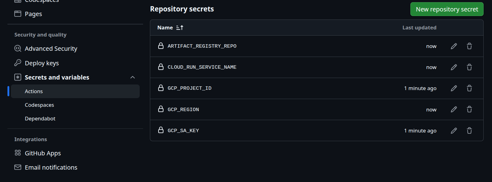

# Setup Instructions

## Creating GCP project

### 0. Install `google-cloud-cli`

Link: https://docs.cloud.google.com/sdk/docs/install-sdk

```bash
curl -O https://dl.google.com/dl/cloudsdk/channels/rapid/downloads/google-cloud-cli-linux-x86_64.tar.gz
tar -xf google-cloud-cli-linux-x86_64.tar.gz
./google-cloud-sdk/install.sh
source ~/.bashrc  # reload PATH so gcloud is available
```

### 1. Authentication to GCP

```bash
gcloud auth login                      # browser opens, log in with your Google account
gcloud auth application-default login  # grants SDK tools (Terraform, gsutil etc.) access
```

### 2. Create SSH Key

Terraform uses this key to configure SSH access to the Kestra VM.

```bash
ssh-keygen -t ed25519 -C "your_email@example.com"  # creates ~/.ssh/id_ed25519 + id_ed25519.pub
```

Skip if `~/.ssh/id_ed25519.pub` already exists.

### 3. Creating GCP project

> **`IMPORTANT`**: Set your own values below. All subsequent commands reference these variables.

```bash
export PROJECT=arxiv-data-pipeline-2  # your unique GCP project ID
export REGION=europe-west1
export ZONE=europe-west1-b
```

You can create the project via the **Web UI** [here](https://console.cloud.google.com/), or via **CLI (here)**:

```bash
gcloud projects create ${PROJECT} --name="ArXiv Data Pipeline"  # create project
gcloud config set project ${PROJECT}                             # set as active project
gcloud auth application-default set-quota-project ${PROJECT}    # point ADC quota to new project
```

### 4. Link billing account
- Go to https://console.cloud.google.com
- Change to newly created project
- Click on Billing and attach Billing account to project

### 5. Create GCS Bucket for Terraform State

Required for both local and production Terraform deployments. GCS bucket names are globally unique, so choose a name that is not already taken (e.g. `arxiv-tf-state-${PROJECT}`).

```bash
gcloud storage buckets create gs://arxiv-tf-state-${PROJECT} --location=${REGION}   # create state bucket
gcloud storage buckets update gs://arxiv-tf-state-${PROJECT} --versioning            # enable versioning for recovery
```

Also set a unique name for the data bucket in `terraform_local/terraform.tfvars` (the default `arxiv-data-bucket` may already be taken).

### 6. Enable Required APIs (can be skipped)

This activates Google Cloud APIs to be used. This is later also done in Terraform's provisioning of cloud resources. This step is here for completeness sake.

```bash
gcloud services enable \
    cloudresourcemanager.googleapis.com \
    iam.googleapis.com \
    storage.googleapis.com \
    bigquery.googleapis.com \
    artifactregistry.googleapis.com \
    run.googleapis.com \
    compute.googleapis.com
```

### Final Checks

Check if everything is correctly set up. Should return values consistent with the configurations done:
```bash
gcloud config list
gcloud projects describe ${PROJECT}
gcloud services list --enabled
```


## Kaggle API Key

The pipeline uses the [Kaggle ArXiv dataset](https://www.kaggle.com/datasets/Cornell-University/arxiv) for historical ingestion. A Kaggle account and API key are required.

1. Create a free account at https://www.kaggle.com
2. Go to **Settings** > **API** > **Create New Token** — this downloads `kaggle.json`
3. Your credentials are inside:
```json
{"username": "your-username", "key": "your-api-key"}
```

How you provide them depends on the setup:
- **Full cloud setup**: add `kaggle_username` and `kaggle_key` to `terraform/terraform.tfvars`
- **Local Kestra setup**: base64-encode and paste into `kestra/.env` (see [Local Kestra + GCP Setup](#local-kestra--gcp-setup))


## Terraform Infrastructure Provisioning

Provisions all GCP resources in one command: GCS bucket, BigQuery datasets, Artifact Registry for Docker container, Kestra VM for orchestration, Cloud Run service, service accounts, IAM bindings and firewall rules.

> **`Note`**: This is the fully cloud-hosted setup where Kestra runs on a GCP VM. If you prefer to run Kestra locally on your machine instead, skip this section and follow [Local Kestra + GCP Setup](#local-kestra--gcp-setup) below.

<details>
<summary>Show full Terraform setup</summary>

### 1. Install Terraform

Follow instructions to install Terraform [here](https://developer.hashicorp.com/terraform/tutorials/aws-get-started/install-cli).

### 2. Configure variables

Copy the example tfvars-file and fill in your values:
```bash
cp terraform/terraform.tfvars.example terraform/terraform.tfvars
```

**Example** (replace with your values):
```bash
project_id             = "arxiv-data-pipeline-2"
region                 = "europe-west1"
my_ip                  = "0.0.0.0/0"
tf_state_bucket        = "arxiv-tf-state-arxiv-data-pipeline-2"
force_destroy_resource = true
kaggle_username        = "kaggle-username"
kaggle_key             = "kaggle_key"
```


### 3. Create resources

> `-chdir=terraform` can be dropped if you execute everything terraform-related in the [`terraform/`](./terraform/) folder. It has to be specified, when everything is done from the project-root.

Initialize, plan and apply the creation of the GCP insfrastructure.

```bash
terraform -chdir=terraform init
terraform -chdir=terraform plan -var-file="terraform.tfvars"
terraform -chdir=terraform apply -var-file="terraform.tfvars" -auto-approve
```

### 4. Tear down resources

```bash
terraform -chdir=terraform destroy -var-file="terraform.tfvars" -auto-approve
```

### Get relevant output data from terraform

```bash
terraform -chdir=terraform output
```

You will get outputs like this:
```bash
data_bucket       = "arxiv-data-bucket"                                        # GCS bucket for ingested data
docker_registry   = "europe-west1-docker.pkg.dev/<project-id>/arxiv-pipeline"  # Your dashboard's container is saved here
ingestion_dataset = "ingestion_dataset"                                        # "Unprocessed" data in BigQuery
kestra_vm_ip      = "<vm-external-ip>"                                         # External IP of Kestra's Cloud VM
processed_dataset = "arxiv_dataset"                                            # "Processed" data in BigQuery
streamlit_url     = "https://<cloud-run-url>"                                  # BI-Dashboard URL
```

### Start and Stop Cloud VM
A helpful command to stop the VM where the Orchestrator is running on, without deleting it with terraform, the following commands can be used:

```bash
# Stop the vm instance without deleting
gcloud compute instances stop kestra-vm --zone=${ZONE}

# Check the state of the resource
gcloud compute instances describe kestra-vm --zone=${ZONE} --format="value(status)"

# Restart the vm instance
gcloud compute instances start kestra-vm --zone=${ZONE}
```

> **`Note`**: Stopping and restarting the VM assigns a new external IP. After restart, get the new IP with:
> ```bash
> terraform -chdir=terraform output kestra_vm_ip
> ```

</details>


## GitHub Actions Setup (for full cloud setup only)

> **Important**: Can only be done if you created the infrastructure that runs fully in the cloud. This key is not needed if the Kestra-Orchestration runs on your computer.

To access GCP services, GitHub Actions requires a service account key to push Docker images to Artifact Registry and deploy them to Cloud Run.

### 1. Obtain the key

During `terraform apply`, the github-sa key is automatically generated and written to `credentials/github-sa.json`. If you need to regenerate it manually:

```bash
# Generate and download github-sa key to credentials/
gcloud iam service-accounts keys create credentials/github-sa.json \
    --iam-account=github-sa@${PROJECT}.iam.gserviceaccount.com
```

### 2. Add secrets to GitHub

The following secrets must be added to the GitHub repository:

| Secret                   | Value                                                   |
| ------------------------ | ------------------------------------------------------- |
| `GCP_SA_KEY`             | base64-encoded contents of `credentials/github-sa.json` |
| `GCP_PROJECT_ID`         | value of `${PROJECT}` (e.g. `arxiv-data-pipeline`)      |
| `GCP_REGION`             | value of `${REGION}` (e.g. `europe-west1`)              |
| `ARTIFACT_REGISTRY_REPO` | `arxiv-pipeline`                                        |
| `CLOUD_RUN_SERVICE_NAME` | `arxiv-streamlit-dashboard`                             |

#### **Option A (Web UI):**

Follow the [GitHub secrets documentation](https://docs.github.com/en/actions/security-guides/encrypted-secrets).

#### **Option B (gh CLI):**

If you have installed the [Github CLI](https://cli.github.com/) and are authenticated, you can use the following commands instead of adding every secret by hand:

```bash
gh secret set GCP_SA_KEY --body "$(base64 -w 0 credentials/github-sa.json)"
gh secret set GCP_PROJECT_ID --body "${PROJECT}"
gh secret set GCP_REGION --body "${REGION}"
gh secret set ARTIFACT_REGISTRY_REPO --body "arxiv-pipeline"
gh secret set CLOUD_RUN_SERVICE_NAME --body "arxiv-streamlit-dashboard"
```

> The values above are examples and can be replaced by your values.




## Local Kestra + GCP Setup (Main one)

Provisions GCS + BigQuery + service account on GCP via Terraform. Kestra runs locally via Docker Compose.

> **`Terraform apply is run twice`**: once before Kestra starts (`deploy_kestra = false`) to create GCP resources and the SA key, and once after (`deploy_kestra = true`) to seed the Kestra KV store and upload namespace files.

### 1. Configure terraform.tfvars

```bash
cp terraform_local/terraform.tfvars.example terraform_local/terraform.tfvars
```

**Example** (replace with your values):

```bash
project_id             = "arxiv-data-pipeline-2"
region                 = "europe-west1"
force_destroy_resource = false
data_bucket            = "arxiv-data-bucket-2"
bq_dataset             = "ingestion_dataset"
categories             = "cs.CV,cs.RO"
data_dir               = "/home/user/arxiv-data-pipeline/pipeline/data"
kestra_url             = "http://localhost:8080"
kestra_username        = "admin@kestra.io"
kestra_password        = "Admin1234!"
deploy_kestra          = false   # set to true after Kestra is running (or via cli as parameter)
```


Fill in `project_id`, `data_bucket` (globally unique name), and `data_dir` (absolute path to `pipeline/data`). Leave `deploy_kestra = false` for now.

### 2. First Terraform apply (GCP resources + SA key)

```bash
terraform -chdir=terraform_local init -backend-config="bucket=arxiv-tf-state-${PROJECT}"
terraform -chdir=terraform_local plan -var-file="terraform.tfvars"
terraform -chdir=terraform_local apply -var-file="terraform.tfvars" -auto-approve
```

This creates GCS, BigQuery datasets, the service account, and writes service account authentification file `credentials/pipeline-sa.json`.

### 3. Configure Kestra credentials

```bash
cp kestra/.env.example kestra/.env
```

Fill in [`kestra/.env`](./kestra/.env) (all values must be base64-encoded). Get them from here:

```bash
echo -n "your-kaggle-username" | base64
echo -n "your-kaggle-api-key" | base64
base64 -w 0 credentials/pipeline-sa.json
```

Paste outputs into `kestra/.env`.

### 4. Start Kestra

```bash
docker compose -f kestra/docker-compose.yml up -d
```

Kestra UI is available at `http://localhost:8080`. Login with `admin@kestra.io` and `Admin1234!`.

### 5. REQUIRED: Second Terraform apply (seeds KV store + uploads namespace files) 

```bash
terraform -chdir=terraform_local apply -var-file="terraform.tfvars" -var="deploy_kestra=true" -auto-approve
```

### 6. Tear down (after EVERYTHING is done!)

> **Proceed with Caution**: this will delete ALL ressources, including BigQuery dataset, GCS Bucket and everythign thats in them! If you want to save data download it first from the <>

```bash
terraform -chdir=terraform_local destroy -var-file="terraform.tfvars" -auto-approve
```


## (Optional): Pre-Commit Hooks (nice to have for the fully online version)

> **Important**: This is mainly used for the fully online version and is still partly under construction (works regardless). 

To allow pre-commit CI tools you have to install `pre-commit` on your system. This can be done with `pipx` or `uv`:

```bash
# Option 1: with pipx
pipx install pre-commit

# Option 2: with uv
uv tool install pre-commit
```

Then register the hooks with git (required once per clone):

```bash
pre-commit install
```

The hooks run automatically on every `git commit`. Config: [.pre-commit-config.yaml](./.pre-commit-config.yaml)
